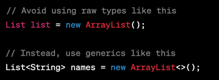
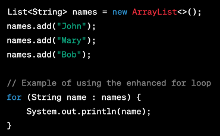
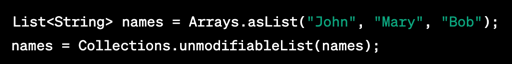
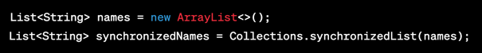
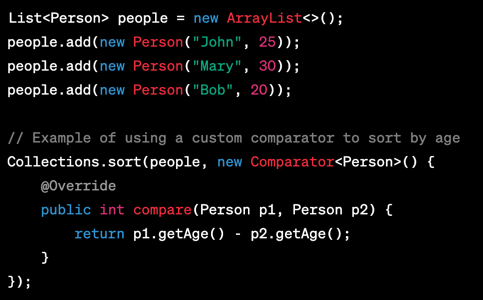
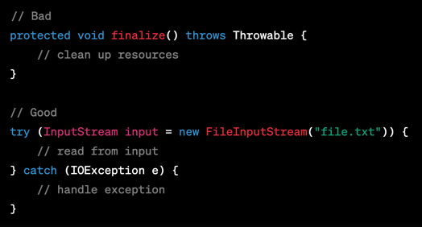
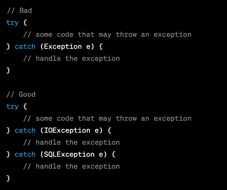
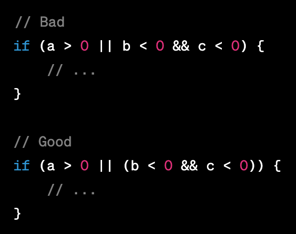
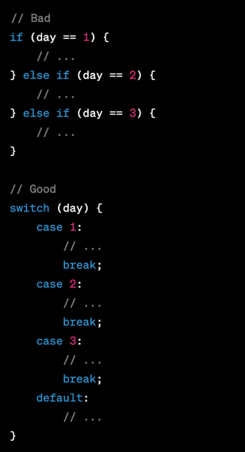
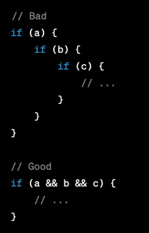

# Java coding best practices:

### Collection framework best practices:
1. Use generics and avoid using raw types - generics to ensure type safety in your collection classes. This helps to prevent errors and makes your code easier to maintain
    >Ex: 
2. Appropriate collection class - based on the requirements of your application. For example, if you need to store and access elements by index, use an ArrayList. If you need to maintain uniqueness of elements, use a HashSet.
3. Choose the appropriate data structure based on the operations you need to perform. For example, if you need to add and remove elements from both ends of a list, use a LinkedList. If you need to maintain elements in sorted order, use a TreeSet.
4. Use the enhanced for loop (**for-each** loop) when iterating over a collection. This is more concise and less error-prone than using an explicit iterator.
    > Ex: 
5. Use immutable collections when you need to ensure that the contents of a collection cannot be modified. This can help to prevent bugs and make your code more thread-safe.
    > Ex: 
6. Use thread-safe collections when working with multiple threads. The **Collections** class provides methods for creating synchronized wrappers around non-thread-safe collections.
    > Ex: 
7. Use the **Comparator** interface to define a custom sort order for your collections. This allows you to sort elements based on any criteria you choose.
    > Ex: 
8. Use the **Map** interface to store key-value pairs. This allows you to associate values with keys and retrieve them quickly.

### Exception handling:
1. Don't use finalizers. Use try-with-resources or explicit resource management instead
    > Ex: 
2. Don't catch generic exceptions. Catch specific exceptions instead
    > Ex: 
3. Use the finally block to ensure that resources are properly released, even if an exception is thrown. This is particularly important when working with file I/O or network connections
4. Avoid catching the Throwable class, as it can catch errors in addition to exceptions, which can lead to unpredictable behavior.

### Conditions:

1. Use meaningful variable names in conditionals
2. Keep conditions simple and easy to read
3. Use parentheses to group conditions
    > Ex: 
5. Use switch statements for multiple conditionals
    > Ex: 
6. Avoid nesting conditions too deeply
    > Ex: 

### Loops:

**For loops:** when you need to iterate over a range of values.
**While loops:** when you need to iterate until a condition is met.
**Do-while loops:** when you need to iterate at least once and then until a condition is met.

1. Use meaningful variable names in loop statements
2. Keep loop conditions simple and easy to read
3. Use break and continue statements judiciously
4. Avoid nesting loops too deeply

